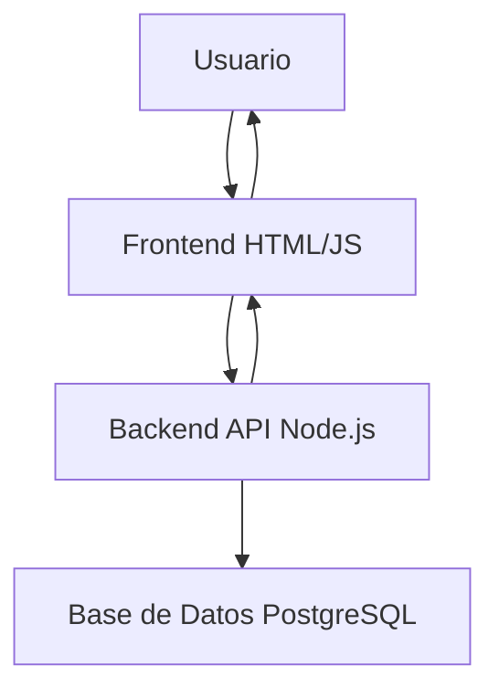

# Ejercicio 2 - Documentar Proyecto Completo

## ⏱️ Duración: 25 minutos
## 🎯 Objetivo: Crear documentación de arquitectura y proyecto

---

## ¿Por Qué Documentar el Proyecto Completo?

### 🤔 Problemas sin documentación de proyecto:
- Nuevo desarrollador tarda semanas en entender el sistema
- Decisiones técnicas se olvidan con el tiempo
- No se sabe por dónde empezar cuando hay un problema
- Difícil mantener código legacy

### ✅ Beneficios:
- Onboarding rápido de nuevos miembros
- Decisiones documentadas para futuras referencias
- Visión global del sistema
- Reduce "conocimiento en la cabeza de una persona"

---

## Parte A: README de Proyecto (10 min)

### 📝 Contexto:

Imagina que tienes un proyecto completo:
```
sistema_billetes_metro/
├── backend/
│   ├── validar_billete.js
│   ├── calcular_tarifa.js
│   └── generar_reporte.js
├── frontend/
│   ├── formulario_recarga.html
│   └── consulta_saldo.html
├── database/
│   └── schema.sql
└── README.md
```

### 📝 Paso 1: Crear README completo

1. **Abre Copilot Chat**
2. **Copia este prompt:**

```
Crea un README.md profesional para un sistema de gestión de billetes de Metro Bilbao.

El sistema tiene:
- Backend en Node.js (validación, cálculo de tarifas, reportes)
- Frontend en HTML/JavaScript (formularios de recarga y consulta)
- Base de datos PostgreSQL (billetes, validaciones, usuarios)

El README debe incluir:
1. Título y descripción ejecutiva
2. Arquitectura general (3 capas)
3. Prerrequisitos
4. Instalación paso a paso
5. Estructura de carpetas explicada
6. Uso básico
7. Ejemplos de casos comunes
8. Troubleshooting
9. Contacto y contribución
```

3. **Guarda el resultado en un nuevo archivo: `README_PROYECTO.md`**

### 📝 Paso 2: Revisar y mejorar

4. **Lee el README generado**
5. **Pregunta a Copilot:** 
```
Este README está bien pero es muy genérico.
Hazlo específico para Metro Bilbao:
- Menciona zonas tarifarias (1, 2, 3)
- Menciona tipos de usuarios (normal, estudiante, tercera edad)
- Agrega emojis para hacerlo más amigable
- Usa tono profesional pero accesible
```

6. **Revisa las mejoras**

### 🤔 Preguntas para discutir:
- ¿El README es suficientemente claro?
- ¿Alguien nuevo podría instalar el sistema solo con esto?
- ¿Qué falta?

---

## Parte B: Documentación de Arquitectura (15 min)

### 📝 Paso 1: Crear ARCHITECTURE.md

1. **En Copilot Chat, pide:**

```
Crea un documento ARCHITECTURE.md que explique la arquitectura del sistema de billetes.

Incluye:
1. Diagrama de arquitectura en formato Mermaid
   - Frontend (HTML/JS)
   - Backend API (Node.js)
   - Base de datos (PostgreSQL)
   - Relaciones entre componentes

2. Descripción de cada capa:
   - Frontend: Responsabilidades, tecnologías
   - Backend: Responsabilidades, endpoints principales
   - Base de datos: Tablas principales

3. Flujo de una validación de billete (paso a paso)

4. Decisiones técnicas importantes:
   - Por qué PostgreSQL
   - Por qué validación en backend
   - Cómo se calculan tarifas

5. Diagrama de flujo de datos
```

2. **Guarda en: `ARCHITECTURE.md`**

### 📝 Paso 2: Visualizar diagrama Mermaid

3. **El diagrama Mermaid generado se verá algo así:**



4. **Para visualizarlo:**
   - Instala extensión "Markdown Preview Mermaid" en VS Code
   - O usa https://mermaid.live para ver el diagrama

### 📝 Paso 3: Refinar documentación

5. **Si el documento es muy técnico, pide:**

```
Simplifica ARCHITECTURE.md para que lo entienda un desarrollador junior.
Usa analogías y ejemplos concretos.
Agrega sección "¿Por dónde empiezo?" con guía rápida.
```

6. **Revisa los cambios**

---

## Parte C: Documentar Decisiones Técnicas (Opcional)

### 📝 Si te sobra tiempo:

#### Crear ADR (Architecture Decision Record)

1. **Pregunta a Copilot:**

```
Crea un documento de decisión técnica (ADR) explicando por qué elegimos:
- PostgreSQL en lugar de MySQL
- Node.js en lugar de Python
- Validación en backend en lugar de solo frontend

Formato:
- Contexto y problema
- Decisión tomada
- Consecuencias (pros y contras)
- Alternativas consideradas
```

2. **Guarda como: `ADR_001_tecnologias.md`**

---

## 🎯 Estructura de Documentación Completa

### 📋 Documentos Típicos de un Proyecto:

```
docs/
├── README.md              # Punto de entrada
├── ARCHITECTURE.md        # Arquitectura general
├── SETUP.md              # Guía de instalación detallada
├── API.md                # Documentación de endpoints
├── DATABASE.md           # Esquema de base de datos
├── CONTRIBUTING.md       # Cómo contribuir
├── CHANGELOG.md          # Historial de cambios
└── adr/                  # Decisiones técnicas
    ├── 001_database.md
    └── 002_framework.md
```

---

## 💡 TIPS para Buena Documentación de Proyecto

### ✅ Documentación Buena:
- Empieza con lo básico (qué hace, cómo instalarlo)
- Incluye diagramas visuales
- Explica el "por qué", no solo el "cómo"
- Se actualiza cuando cambia el código

### ❌ Documentación Mala:
- Solo código sin explicación
- Muy larga y densa
- Desactualizada
- Sin ejemplos concretos

---

## 🆘 Si Te Atascas

### Problema: El diagrama Mermaid no se ve
**Solución:**
1. Instala extensión Mermaid en VS Code
2. O copia el código a https://mermaid.live
3. O usa formato texto simple si hace falta

### Problema: La documentación es muy técnica
**Solución:**
Pide: "Reescribe esto para un público no técnico" o "Simplifica usando analogías"

### Problema: Falta información
**Solución:**
Pregunta: "¿Qué secciones adicionales debería incluir en la arquitectura de un sistema [tipo]?"

---

## 🎯 Patrón para Prompts de Arquitectura

### Template efectivo:

```
Documenta la arquitectura de [PROYECTO].

El sistema tiene estos componentes:
- [Componente 1: descripción]
- [Componente 2: descripción]
- [Componente 3: descripción]

Incluye:
1. Diagrama Mermaid mostrando relaciones
2. Descripción de cada componente
3. Flujo de [operación principal]
4. Decisiones técnicas clave
5. Guía de troubleshooting

Audiencia: [Desarrolladores junior / Senior / No técnicos]
```

---

## 📊 Niveles de Documentación

| Nivel | Qué Incluye | Para Quién |
|-------|-------------|------------|
| **Básico** | README con setup | Nuevos usuarios |
| **Intermedio** | + ARCHITECTURE.md | Nuevos desarrolladores |
| **Avanzado** | + ADRs, API docs | Todo el equipo |
| **Completo** | + Diagramas, ejemplos, FAQ | Organización completa |

---

## ✅ Cierre del Ejercicio

### Lo que aprendimos:
- ✅ Crear README completo de proyecto
- ✅ Documentar arquitectura con diagramas
- ✅ Explicar decisiones técnicas (ADRs)
- ✅ Copilot puede generar documentación estructurada

### Para practicar:
- Toma un proyecto existente sin documentación
- Pídele a Copilot que genere README y ARCHITECTURE
- Revisa con tu equipo
- Itera y mejora

---

## 🔜 Siguiente Ejercicio

Vamos a cerrar el curso con **mejores prácticas** y un checklist completo de lo aprendido.
