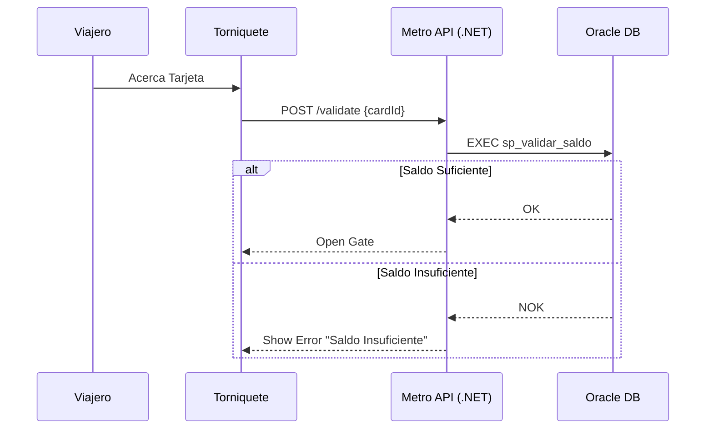

# Ejercicio 2: Creación de README Profesional

## 🎯 Objetivo
Crear la "portada" perfecta para nuestro proyecto. Un buen README reduce el tiempo de onboarding de nuevos desarrolladores y evita preguntas repetitivas sobre cómo configurar el entorno.

## 📝 Contexto
El proyecto "Metro Bilbao Validation Core" ha crecido mucho. Tenemos:
- Backend en .NET 8
- Base de datos Oracle 23c
- Dependencias de Docker
- Scripts de inicialización específicos

Un nuevo desarrollador senior se incorpora mañana y no hay documentación de cómo arrancar el proyecto.

## 🔧 Pasos del Ejercicio

### Paso 1: Estructura Base
Crea un archivo `README.md` vacío en la raíz de tu espacio de trabajo.

### Paso 2: Prompt Inicial ("El Borrador")
Pide a Copilot que genere la estructura completa:

> "Genera un README.md profesional para el proyecto 'Metro Bilbao Validation Core'.
>
> Stack tecnológico:
> - .NET 8 (C#)
> - Oracle Database 23c Free (Docker)
> - Visual Studio 2022 / VS Code
>
> Secciones requeridas:
> 1. Título y Descripción breve
> 2. Requisitos previos (Prerequisites)
> 3. Guía de Instalación (Setup)
> 4. Configuración de Base de Datos (importante: mencionar usuario 'metro_user')
> 5. Cómo ejecutar la API
> 6. Cómo ejecutar los Tests"

### Paso 3: Diagramas de Arquitectura (Mermaid)
Una imagen vale más que mil palabras. Pide a Copilot que genere un diagrama:

> "Añade una sección 'Arquitectura' después de la descripción. Genera un diagrama de secuencia usando sintaxis Mermaid que muestre el flujo:
> 1. Usuario acerca tarjeta al torniquete
> 2. Torniquete llama a API .NET
> 3. API valida saldo en Oracle
> 4. Oracle responde OK/NOK
> 5. API abre/bloquea torniquete"

### Paso 4: Sección de Troubleshooting (Solución de Problemas)
Esta es la sección que más agradecen los desarrolladores.

> "Añade una sección de 'Troubleshooting' con estos problemas comunes:
> - Error ORA-12541: TNS:no listener (Solución: verificar contenedor Docker)
> - Error de conexión .NET: Verificar ConnectionString en appsettings.json"

### 💡 Resultado Esperado (Fragmento)

```markdown
# Metro Bilbao Validation Core 🚇

Sistema central de validación de títulos de transporte y gestión de tarifas para Metro Bilbao.

## 🏗️ Arquitectura



## 🚀 Getting Started

### Prerrequisitos
- Docker Desktop
- .NET SDK 8.0
- Visual Studio 2022 (con carga de trabajo ASP.NET)

### 🗄️ Base de Datos (Oracle)
El proyecto usa **Oracle Database 23c Free** en contenedor.

1. Levantar base de datos:
   ```bash
   docker-compose up -d
   ```
2. Ejecutar scripts de inicialización ubicados en `/database/seeds`.

...
```

## 🧠 Reto Adicional
Pide a Copilot que genere "Badges" (escudos) para el inicio del README que muestren:
- Estado del Build (Passing)
- Versión de .NET (8.0)
- Licencia (Proprietaria)
