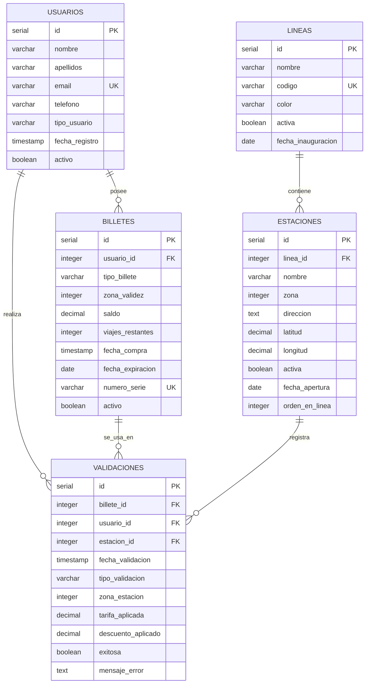

# Diagrama Entity-Relationship - Sistema Metro Bilbao

Este diagrama muestra las relaciones entre las principales tablas del sistema de gestión del Metro de Bilbao.

---

## 🗺️ Diagrama ER Completo

---

## 📊 Descripción de Relaciones

| Relación | Cardinalidad | Descripción |
|----------|--------------|-------------|
| **USUARIOS → BILLETES** | 1:N | Un usuario puede poseer múltiples billetes/bonos activos |
| **USUARIOS → VALIDACIONES** | 1:N | Un usuario puede realizar múltiples validaciones (entradas/salidas) |
| **BILLETES → VALIDACIONES** | 1:N | Un billete se utiliza en múltiples validaciones durante su vida útil |
| **ESTACIONES → VALIDACIONES** | 1:N | Cada estación registra múltiples validaciones diarias |
| **LINEAS → ESTACIONES** | 1:N | Una línea de metro contiene múltiples estaciones en su recorrido |

---

## 🔑 Leyenda

- **PK**: Primary Key (Clave Primaria)
- **FK**: Foreign Key (Clave Foránea)
- **UK**: Unique Key (Clave Única)
- **||--o{**: Relación Uno a Muchos (1:N)

---

## 📌 Notas Importantes

1. **VALIDACIONES** es la tabla de hechos central que registra cada transacción.
2. No existe una tabla `TARIFAS` independiente; los precios se calculan mediante el procedimiento `SP_CALCULAR_TARIFA` basándose en:
   - Zona de origen y destino
   - Tipo de usuario (regular, estudiante, tercera_edad)
3. El campo `tipo_validacion` en **VALIDACIONES** puede ser `'entrada'` o `'salida'`.
4. El sistema maneja 3 zonas tarifarias (1, 2, 3) que determinan el precio del viaje.

---

## 🚀 Visualización

Para visualizar este diagrama:
1. Abre este archivo en VS Code
2. Presiona `Ctrl+Shift+V` (Windows/Linux) o `Cmd+Shift+V` (Mac)
3. El diagrama se renderizará automáticamente en el preview de Markdown

Alternativamente, puedes usar:
- [Mermaid Live Editor](https://mermaid.live/)
- GitHub (renderiza Mermaid nativamente)
- Extensión de VS Code: "Markdown Preview Mermaid Support"
