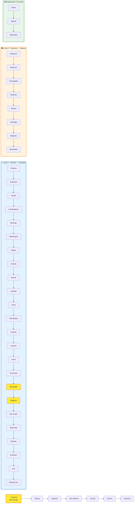
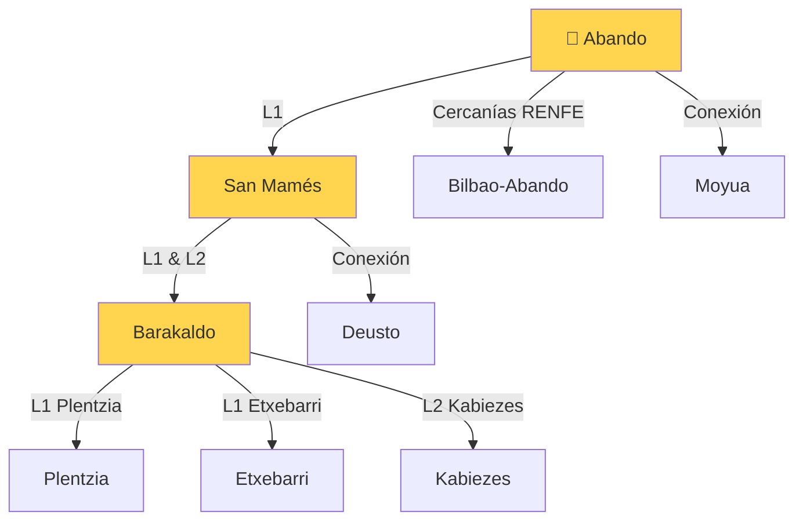

# Diagrama de la Red del Metro de Bilbao

Generado automáticamente desde datos abiertos (Open Data).

## 🗺️ Topología de la Red

---

## 📊 Estadísticas de la Red

| Métrica | Valor |
|---------|-------|
| **Total de estaciones** | 49 estaciones físicas |
| **Total de accesos** | 123 puntos de entrada/salida |
| **Líneas operativas** | 2 líneas principales (L1, L2) |
| **Zonas tarifarias** | 3 zonas (Centro, Intermedia, Exterior) |
| **Longitud aproximada** | ~43 km de red |

---

## 🎯 Estaciones con Mayor Complejidad

Estaciones con **4 o más accesos** (ascensores, entradas, conexiones):

| Estación | Accesos | Tipo |
|----------|---------|------|
| **Abando (ABA)** | 4 | Ascensor, Berastegi, Gran Vía, RENFE |
| **Barakaldo (BAR)** | 4 | Ascensor, Elkano, Foruak, Euskadi |
| **Bagatza (BAG)** | 3 | Ascensor, Gabriel Aresti, Santa Teresa |
| **Santurtzi (STZ)** | 4 | Ascensor, Las Viñas, Casa Torre, Mamariga |

---

## 🚇 Principales Intercambiadores

---

## 📍 Coordenadas GPS de Estaciones Clave

| Estación | Latitud | Longitud | Zona |
|----------|---------|----------|------|
| Plentzia | 43.40183 | -2.94640 | 3 |
| Abando | 43.26144 | -2.92820 | 1 |
| San Mamés | 43.26254 | -2.94819 | 1 |
| Barakaldo | 43.29531 | -2.98890 | 2 |
| Etxebarri | 43.24387 | -2.89668 | 1 |
| Kabiezes | 43.32231 | -3.03661 | 2 |

---

## 🛠️ Generado con:

- **Fuente**: Open Data Metro Bilbao (`estaciones.csv`)
- **Herramienta**: GitHub Copilot + Mermaid.js
- **Formato**: GTFS (General Transit Feed Specification)

**💡 Este diagrama fue generado automáticamente analizando 123 registros del CSV oficial en menos de 1 minuto.**
