# Diagrama de Red - Metro Bilbao

> Generado automáticamente desde `estaciones.csv` (OpenData Metro Bilbao)

---

## 🗺️ Mapa de la Red

```mermaid
graph LR
    subgraph L1["🔵 LÍNEA 1 - Etxebarri ↔ Plentzia"]
        direction LR
        ETX[Etxebarri] --> BOL[Bolueta]
        BOL --> BAS[Basarrate]
        BAS --> SAN[Santutxu]
        SAN --> CAV["🚉 Casco Viejo"]
        CAV --> ABA["🚉 Abando"]
        ABA --> MOY[Moyua]
        MOY --> IND[Indautxu]
        IND --> SAM["🚉 San Mamés"]
        SAM --> DEU[Deusto]
        DEU --> SAR[Sarriko]
        SAR --> LUT[Lutxana]
        LUT --> ERA[Erandio]
        ERA --> AST[Astrabudua]
        AST --> LEI[Leioa]
        LEI --> PLE[... Plentzia]
    end

    subgraph L2["🟠 LÍNEA 2 - Basauri ↔ Kabiezes"]
        direction LR
        BSR[Basauri] --> ARZ[Ariz]
        ARZ --> ETX2[Etxebarri]
        ETX2 --> BOL2[Bolueta]
        BOL2 --> BAS2[Basarrate]
        BAS2 --> SAN2[Santutxu]
        SAN2 --> CAV2["🚉 Casco Viejo"]
        CAV2 --> ABA2["🚉 Abando"]
        ABA2 --> SAM2["🚉 San Mamés"]
        SAM2 --> SIN[San Inazio]
        SIN --> GUR["🚉 Gurutzeta"]
        GUR --> BAR["🚉 Barakaldo"]
        BAR --> BAG[Bagatza]
        BAG --> URB[Urbinaga]
        URB --> SES[Sestao]
        SES --> KAB[... Kabiezes]
    end

    %% Conexiones entre líneas (Intercambiadores)
    CAV -.->|"Transbordo"| CAV2
    ABA -.->|"Transbordo"| ABA2
    SAM -.->|"Transbordo"| SAM2

    %% Estilos
    style L1 fill:#e3f2fd,stroke:#1976d2,stroke-width:3px
    style L2 fill:#fff3e0,stroke:#ff9800,stroke-width:3px
    
    style ETX fill:#1976d2,color:#fff
    style PLE fill:#1976d2,color:#fff
    style BSR fill:#ff9800,color:#fff
    style KAB fill:#ff9800,color:#fff
    
    style CAV fill:#ffd700,stroke:#333,stroke-width:2px
    style ABA fill:#ffd700,stroke:#333,stroke-width:2px
    style SAM fill:#ffd700,stroke:#333,stroke-width:2px
    style CAV2 fill:#ffd700,stroke:#333,stroke-width:2px
    style ABA2 fill:#ffd700,stroke:#333,stroke-width:2px
    style SAM2 fill:#ffd700,stroke:#333,stroke-width:2px
    style GUR fill:#ffd700,stroke:#333,stroke-width:2px
    style BAR fill:#ffd700,stroke:#333,stroke-width:2px
```

---

## 📋 Leyenda

| Símbolo | Significado |
|---------|-------------|
| 🔵 | Línea 1 (Etxebarri - Plentzia) |
| 🟠 | Línea 2 (Basauri - Kabiezes) |
| 🚉 | Estación Intercambiador |
| `───` | Conexión directa entre estaciones |
| `- -` | Transbordo entre líneas |
| 🟡 | Nodo dorado = Intercambiador |

---

## 🚉 Estaciones Intercambiador

| Estación | Líneas | Conexiones Externas |
|----------|--------|---------------------|
| **Casco Viejo** | L1, L2 | Casco histórico de Bilbao |
| **Abando** | L1, L2 | RENFE Cercanías, Euskotren |
| **San Mamés** | L1, L2 | Estadio San Mamés, Termibus |
| **Gurutzeta/Cruces** | L2 | Hospital Universitario Cruces |
| **Barakaldo** | L2 | Centro comercial MegaPark |

---

## 📊 Estadísticas de la Red

| Métrica | Valor |
|---------|-------|
| Total estaciones | 49 |
| Total accesos | 123 |
| Líneas | 2 (L1, L2) |
| Intercambiadores | 5 |
| Longitud total | ~45 km |

---

## 👁️ Visualización

Para ver este diagrama renderizado:
1. Abre este archivo en VS Code
2. Pulsa `Cmd+Shift+V` (Mac) o `Ctrl+Shift+V` (Windows)
3. Requiere extensión: **Markdown Preview Mermaid Support** (`bierner.markdown-mermaid`)

---

*Fuente: [OpenData Metro Bilbao](https://www.metrobilbao.eus/es/open-data/dataset/estaciones)*

| Estación | Latitud | Longitud | Zona |
|----------|---------|----------|------|
| Plentzia | 43.40183 | -2.94640 | 3 |
| Abando | 43.26144 | -2.92820 | 1 |
| San Mamés | 43.26254 | -2.94819 | 1 |
| Barakaldo | 43.29531 | -2.98890 | 2 |
| Etxebarri | 43.24387 | -2.89668 | 1 |
| Kabiezes | 43.32231 | -3.03661 | 2 |

---

## 🛠️ Generado con:

- **Fuente**: Open Data Metro Bilbao (`estaciones.csv`)
- **Herramienta**: GitHub Copilot + Mermaid.js
- **Formato**: GTFS (General Transit Feed Specification)

**💡 Este diagrama fue generado automáticamente analizando 123 registros del CSV oficial en menos de 1 minuto.**
