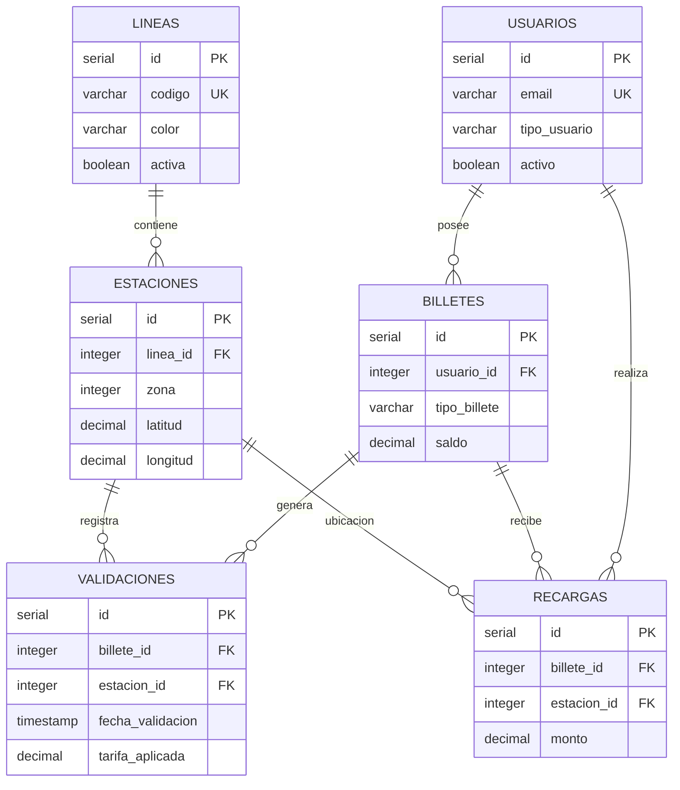

# Diccionario de Datos - Metro Bilbao

> Documentación generada automáticamente del esquema `metro_schema.sql`
> 
> **Sistema**: Metro Bilbao - Gestión de Validaciones y Tarifas
> **Compatibilidad**: PostgreSQL / Oracle (con ajustes menores)

---

## 📊 Diagrama de Relaciones

---

## 📑 Índice de Tablas

| Tabla | Dominio | Descripción |
|-------|---------|-------------|
| [LINEAS](#tabla-lineas) | Infraestructura | Líneas del metro (L1, L2, etc.) |
| [ESTACIONES](#tabla-estaciones) | Infraestructura | Estaciones con ubicación y zona tarifaria |
| [USUARIOS](#tabla-usuarios) | Comercial | Usuarios registrados en el sistema |
| [BILLETES](#tabla-billetes) | Comercial | Títulos de transporte activos |
| [RECARGAS](#tabla-recargas) | Operacional | Historial de recargas de saldo |
| [VALIDACIONES](#tabla-validaciones) | Operacional | Registro de entradas/salidas |

---

## ⚠️ Reglas de Negocio Críticas

> **🎫 MENORES DE 6 AÑOS**: Viajan **GRATIS** en todo el sistema Metro Bilbao.
> - No requieren billete ni título de transporte
> - No pasan por torniquete (acceso por puerta lateral)
> - No generan registros en `USUARIOS`, `BILLETES` ni `VALIDACIONES`
> - Deben ir acompañados de un adulto con título válido

---
