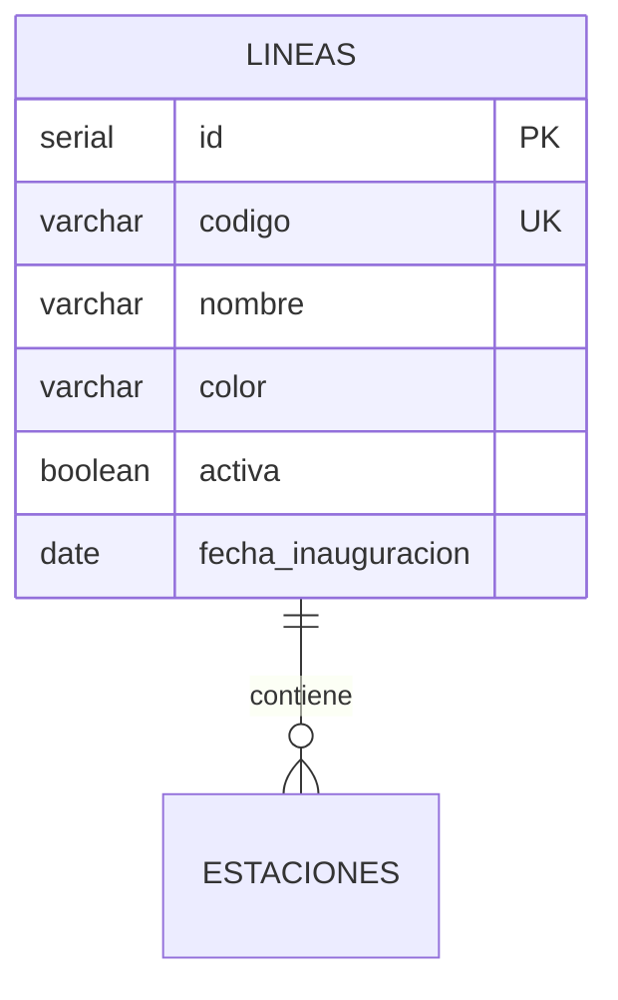

# Tabla: `LINEAS`

**Propósito**: Catálogo maestro de las líneas del Metro de Bilbao. Almacena información básica de cada línea como su código identificador, color corporativo y estado operativo.

**Dominio**: 🚇 Infraestructura

---

## Columnas

| Columna | Tipo | Restricciones | Descripción |
|---------|------|---------------|-------------|
| `id` | SERIAL | **PK** | Identificador único auto-incremental |
| `nombre` | VARCHAR(50) | NOT NULL | Nombre completo de la línea (ej: "Línea 1 - Etxebarri-Plentzia") |
| `codigo` | VARCHAR(10) | **UK**, NOT NULL | Código corto único (ej: "L1", "L2") |
| `color` | VARCHAR(20) | - | Color corporativo de la línea (ej: "rojo", "amarillo") |
| `activa` | BOOLEAN | DEFAULT true | Indica si la línea está en servicio |
| `fecha_inauguracion` | DATE | - | Fecha de puesta en marcha de la línea |

---

## Relaciones



| Relación | Tabla Relacionada | Cardinalidad | Descripción |
|----------|-------------------|--------------|-------------|
| FK desde ESTACIONES | `estaciones.linea_id` | 1:N | Una línea contiene múltiples estaciones |

---

## Índices

| Nombre | Columnas | Tipo | Propósito |
|--------|----------|------|-----------|
| `lineas_pkey` | id | PRIMARY KEY | Búsqueda por ID |
| `lineas_codigo_key` | codigo | UNIQUE | Búsqueda por código de línea |

---

## Reglas de Negocio

- El código de línea debe ser único en todo el sistema
- Una línea inactiva (`activa = false`) no debería aceptar nuevas validaciones
- El color se usa para representación visual en apps y señalética

---

## Ejemplos de Datos

```sql
INSERT INTO lineas (nombre, codigo, color, activa, fecha_inauguracion) VALUES
('Línea 1 - Etxebarri-Plentzia', 'L1', 'rojo', true, '1995-11-11'),
('Línea 2 - Basauri-Kabiezes', 'L2', 'amarillo', true, '2002-04-21'),
('Línea 3 - Matiko-Kukullaga', 'L3', 'verde', true, '2017-04-08');
```

---

## Consultas Frecuentes

```sql
-- Obtener todas las líneas activas
SELECT codigo, nombre, color 
FROM lineas 
WHERE activa = true 
ORDER BY codigo;

-- Contar estaciones por línea
SELECT l.codigo, l.nombre, COUNT(e.id) as num_estaciones
FROM lineas l
LEFT JOIN estaciones e ON l.id = e.linea_id
GROUP BY l.id, l.codigo, l.nombre;
```
