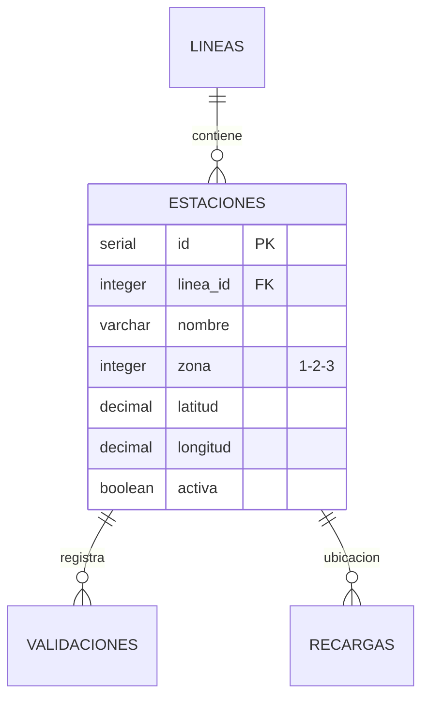

# Tabla: `ESTACIONES`

**Propósito**: Catálogo de estaciones del Metro de Bilbao con información geográfica (coordenadas GPS), zona tarifaria y estado operativo. Es fundamental para el cálculo de tarifas basado en zonas.

**Dominio**: 🚇 Infraestructura

---

## Columnas

| Columna | Tipo | Restricciones | Descripción |
|---------|------|---------------|-------------|
| `id` | SERIAL | **PK** | Identificador único auto-incremental |
| `nombre` | VARCHAR(100) | NOT NULL | Nombre de la estación (ej: "Abando", "Casco Viejo") |
| `linea_id` | INTEGER | **FK** → lineas(id) | Línea a la que pertenece la estación |
| `zona` | INTEGER | NOT NULL, CHECK (1,2,3) | Zona tarifaria: 1=centro, 2=periferia cercana, 3=periferia lejana |
| `direccion` | TEXT | - | Dirección postal de la estación |
| `latitud` | DECIMAL(10,7) | - | Coordenada GPS latitud |
| `longitud` | DECIMAL(10,7) | - | Coordenada GPS longitud |
| `activa` | BOOLEAN | DEFAULT true | Indica si la estación está operativa |
| `fecha_apertura` | DATE | - | Fecha de inauguración |
| `orden_en_linea` | INTEGER | - | Posición secuencial en la línea (para ordenar paradas) |

---

## Relaciones



| Relación | Tabla Relacionada | Cardinalidad | Descripción |
|----------|-------------------|--------------|-------------|
| FK a LINEAS | `lineas.id` | N:1 | Cada estación pertenece a una línea |
| FK desde VALIDACIONES | `validaciones.estacion_id` | 1:N | Una estación tiene múltiples validaciones |
| FK desde RECARGAS | `recargas.estacion_id` | 1:N | Las recargas pueden hacerse en estaciones |

---

## Índices

| Nombre | Columnas | Tipo | Propósito |
|--------|----------|------|-----------|
| `estaciones_pkey` | id | PRIMARY KEY | Búsqueda por ID |
| `idx_estaciones_zona` | zona | INDEX | Filtrado por zona tarifaria |

---

## Reglas de Negocio

- **Zonas tarifarias**: 
  - Zona 1: Centro de Bilbao (€1.50 base)
  - Zona 2: Periferia cercana (€2.00 base)  
  - Zona 3: Periferia lejana (€2.50 base)
- La tarifa de un viaje se calcula según la zona MÁS ALTA entre origen y destino
- Estaciones inactivas no deben permitir validaciones
- Las coordenadas GPS se usan para apps de localización y mapas

---

## Ejemplos de Datos

```sql
INSERT INTO estaciones (nombre, linea_id, zona, latitud, longitud, activa, orden_en_linea) VALUES
('Abando', 1, 1, 43.26144, -2.92820, true, 1),
('Casco Viejo', 1, 1, 43.25890, -2.92340, true, 2),
('Santutxu', 1, 2, 43.25400, -2.90100, true, 5),
('Etxebarri', 1, 2, 43.24387, -2.89668, true, 8),
('Plentzia', 1, 3, 43.40800, -2.94600, true, 25);
```

---

## Consultas Frecuentes

```sql
-- Estaciones por zona tarifaria
SELECT zona, COUNT(*) as num_estaciones
FROM estaciones
WHERE activa = true
GROUP BY zona
ORDER BY zona;

-- Buscar estaciones cercanas (ejemplo: radio 1km desde Abando)
SELECT nombre, zona,
       (6371 * acos(cos(radians(43.26144)) * cos(radians(latitud)) 
       * cos(radians(longitud) - radians(-2.92820)) 
       + sin(radians(43.26144)) * sin(radians(latitud)))) AS distancia_km
FROM estaciones
HAVING distancia_km < 1
ORDER BY distancia_km;

-- Listado ordenado de estaciones de una línea
SELECT e.orden_en_linea, e.nombre, e.zona
FROM estaciones e
JOIN lineas l ON e.linea_id = l.id
WHERE l.codigo = 'L1'
ORDER BY e.orden_en_linea;
```
