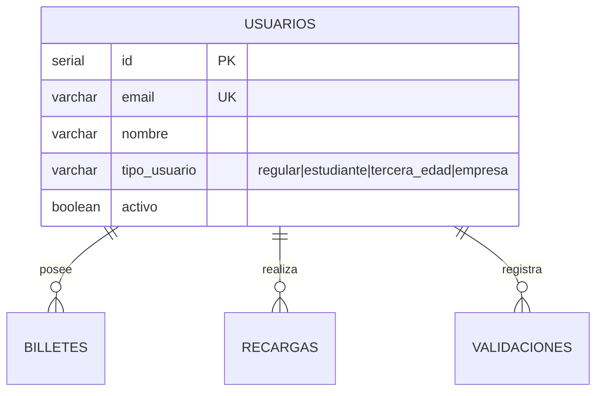

# Tabla: `USUARIOS`

**Propósito**: Registro de clientes del Metro de Bilbao. Almacena datos personales y el tipo de perfil que determina los descuentos aplicables en las tarifas.

**Dominio**: 💳 Comercial

---

## Columnas

| Columna | Tipo | Restricciones | Descripción |
|---------|------|---------------|-------------|
| `id` | SERIAL | **PK** | Identificador único auto-incremental |
| `nombre` | VARCHAR(100) | NOT NULL | Nombre del usuario |
| `apellidos` | VARCHAR(150) | - | Apellidos del usuario |
| `email` | VARCHAR(150) | **UK** | Correo electrónico único |
| `telefono` | VARCHAR(20) | - | Número de contacto |
| `tipo_usuario` | VARCHAR(20) | NOT NULL, CHECK | Perfil: 'regular', 'estudiante', 'tercera_edad', 'empresa' |
| `fecha_registro` | TIMESTAMP | DEFAULT CURRENT_TIMESTAMP | Fecha de alta en el sistema |
| `activo` | BOOLEAN | DEFAULT true | Estado del usuario |

---

## Relaciones



| Relación | Tabla Relacionada | Cardinalidad | Descripción |
|----------|-------------------|--------------|-------------|
| FK desde BILLETES | `billetes.usuario_id` | 1:N | Un usuario puede tener múltiples títulos de transporte |
| FK desde RECARGAS | `recargas.usuario_id` | 1:N | Un usuario realiza múltiples recargas |
| FK desde VALIDACIONES | `validaciones.usuario_id` | 1:N | Registro de viajes del usuario |

---

## Índices

| Nombre | Columnas | Tipo | Propósito |
|--------|----------|------|-----------|
| `usuarios_pkey` | id | PRIMARY KEY | Búsqueda por ID |
| `usuarios_email_key` | email | UNIQUE | Búsqueda por email |
| `idx_usuarios_tipo` | tipo_usuario | INDEX | Segmentación por perfil |

---

## Reglas de Negocio

### Tipos de Usuario y Descuentos

| Tipo | Descuento | Requisitos |
|------|-----------|------------|
| `regular` | 0% | Tarifa completa |
| `estudiante` | 30% | Acreditación académica vigente |
| `tercera_edad` | 50% | Mayor de 65 años |
| `empresa` | Variable | Contrato corporativo |

### Reglas Adicionales

- ⚠️ **Los menores de 6 años viajan GRATIS** y no requieren registro en el sistema
- El email es obligatorio para recuperación de cuenta
- Un usuario inactivo no puede realizar validaciones ni recargas
- El tipo de usuario se verifica periódicamente (ej: estudiantes al inicio de cada curso)

---

## Ejemplos de Datos

```sql
INSERT INTO usuarios (nombre, apellidos, email, telefono, tipo_usuario) VALUES
('Iker', 'García Etxebarria', 'iker.garcia@email.com', '688123456', 'regular'),
('Amaia', 'López Aguirre', 'amaia.lopez@universidad.es', '677234567', 'estudiante'),
('José Luis', 'Martínez Ruiz', 'joseluis@email.com', '666345678', 'tercera_edad'),
('Metro Corp', 'S.L.', 'admin@metrocorp.com', '944123456', 'empresa');
```

---

## Consultas Frecuentes

```sql
-- Distribución de usuarios por tipo
SELECT tipo_usuario, COUNT(*) as total,
       ROUND(COUNT(*) * 100.0 / SUM(COUNT(*)) OVER(), 2) as porcentaje
FROM usuarios
WHERE activo = true
GROUP BY tipo_usuario
ORDER BY total DESC;

-- Usuarios con más viajes en el último mes
SELECT u.nombre, u.apellidos, u.tipo_usuario, COUNT(v.id) as num_viajes
FROM usuarios u
JOIN validaciones v ON u.id = v.usuario_id
WHERE v.fecha_validacion >= CURRENT_DATE - INTERVAL '30 days'
  AND v.tipo_validacion = 'entrada'
GROUP BY u.id, u.nombre, u.apellidos, u.tipo_usuario
ORDER BY num_viajes DESC
LIMIT 10;

-- Usuarios registrados por mes
SELECT DATE_TRUNC('month', fecha_registro) as mes,
       COUNT(*) as nuevos_usuarios
FROM usuarios
GROUP BY DATE_TRUNC('month', fecha_registro)
ORDER BY mes DESC;
```
