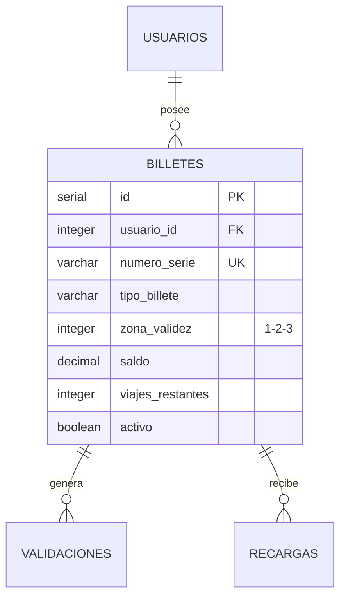

# Tabla: `BILLETES`

**Propósito**: Registro de títulos de transporte (billetes y bonos) asociados a usuarios. Controla el tipo de billete, zona de validez, saldo disponible y viajes restantes.

**Dominio**: 💳 Comercial

---

## Columnas

| Columna | Tipo | Restricciones | Descripción |
|---------|------|---------------|-------------|
| `id` | SERIAL | **PK** | Identificador único auto-incremental |
| `usuario_id` | INTEGER | **FK** → usuarios(id) | Usuario propietario del billete |
| `tipo_billete` | VARCHAR(30) | NOT NULL, CHECK | Tipo: 'sencillo', 'bono_10', 'bono_30', 'mensual', 'anual' |
| `zona_validez` | INTEGER | NOT NULL, CHECK (1,2,3) | Zona máxima permitida para viajar |
| `saldo` | DECIMAL(10,2) | DEFAULT 0.00 | Saldo monetario disponible (€) |
| `viajes_restantes` | INTEGER | DEFAULT 0 | Viajes disponibles (para bonos) |
| `fecha_compra` | TIMESTAMP | DEFAULT CURRENT_TIMESTAMP | Fecha de adquisición |
| `fecha_expiracion` | DATE | - | Fecha límite de validez |
| `numero_serie` | VARCHAR(50) | **UK**, NOT NULL | Número único de identificación física |
| `activo` | BOOLEAN | DEFAULT true | Estado del billete |

---

## Relaciones



| Relación | Tabla Relacionada | Cardinalidad | Descripción |
|----------|-------------------|--------------|-------------|
| FK a USUARIOS | `usuarios.id` | N:1 | Cada billete pertenece a un usuario |
| FK desde VALIDACIONES | `validaciones.billete_id` | 1:N | Un billete genera múltiples validaciones |
| FK desde RECARGAS | `recargas.billete_id` | 1:N | Un billete puede recibir múltiples recargas |

---

## Índices

| Nombre | Columnas | Tipo | Propósito |
|--------|----------|------|-----------|
| `billetes_pkey` | id | PRIMARY KEY | Búsqueda por ID |
| `billetes_numero_serie_key` | numero_serie | UNIQUE | Búsqueda por número físico |
| `idx_billetes_usuario` | usuario_id | INDEX | Billetes de un usuario |

---

## Reglas de Negocio

### Tipos de Billete

| Tipo | Descripción | Validez | Funcionamiento |
|------|-------------|---------|----------------|
| `sencillo` | Viaje único | 1 día | Se consume al validar salida |
| `bono_10` | 10 viajes | 30 días | Descuenta de `viajes_restantes` |
| `bono_30` | 30 viajes | 60 días | Descuenta de `viajes_restantes` |
| `mensual` | Viajes ilimitados | 30 días | Valida por `fecha_expiracion` |
| `anual` | Viajes ilimitados | 365 días | Valida por `fecha_expiracion` |

### Reglas de Validación

- ⚠️ **MENORES DE 6 AÑOS**: Viajan **GRATIS** sin necesidad de billete ni validación
- La `zona_validez` debe ser >= a la zona de la estación donde se valida
- Si `viajes_restantes = 0` y es bono, la validación falla
- Si `fecha_expiracion < fecha_actual`, el billete está caducado
- El `numero_serie` se imprime físicamente en la tarjeta

### Cálculo de Tarifas por Zona

| Zona Máxima | Tarifa Base |
|-------------|-------------|
| Zona 1 | €1.50 |
| Zona 2 | €2.00 |
| Zona 3 | €2.50 |

---

## Ejemplos de Datos

```sql
INSERT INTO billetes (usuario_id, tipo_billete, zona_validez, saldo, viajes_restantes, fecha_expiracion, numero_serie) VALUES
(1, 'bono_10', 2, 0.00, 7, '2025-12-31', 'MB-2025-000001'),
(2, 'mensual', 3, 0.00, 0, '2025-12-31', 'MB-2025-000002'),
(3, 'bono_30', 1, 0.00, 22, '2026-01-15', 'MB-2025-000003'),
(1, 'sencillo', 1, 1.50, 1, '2025-12-02', 'MB-2025-000004');
```

---

## Consultas Frecuentes

```sql
-- Billetes activos por tipo
SELECT tipo_billete, COUNT(*) as cantidad,
       SUM(viajes_restantes) as viajes_totales
FROM billetes
WHERE activo = true AND (fecha_expiracion IS NULL OR fecha_expiracion >= CURRENT_DATE)
GROUP BY tipo_billete
ORDER BY cantidad DESC;

-- Billetes próximos a caducar (7 días)
SELECT b.numero_serie, u.nombre, b.tipo_billete, 
       b.fecha_expiracion, b.viajes_restantes
FROM billetes b
JOIN usuarios u ON b.usuario_id = u.id
WHERE b.activo = true
  AND b.fecha_expiracion BETWEEN CURRENT_DATE AND CURRENT_DATE + INTERVAL '7 days'
ORDER BY b.fecha_expiracion;

-- Ingresos por tipo de billete (último mes)
SELECT b.tipo_billete,
       COUNT(DISTINCT b.id) as billetes_vendidos,
       SUM(v.tarifa_aplicada) as ingresos_total
FROM billetes b
JOIN validaciones v ON b.id = v.billete_id
WHERE b.fecha_compra >= CURRENT_DATE - INTERVAL '30 days'
GROUP BY b.tipo_billete
ORDER BY ingresos_total DESC;
```
