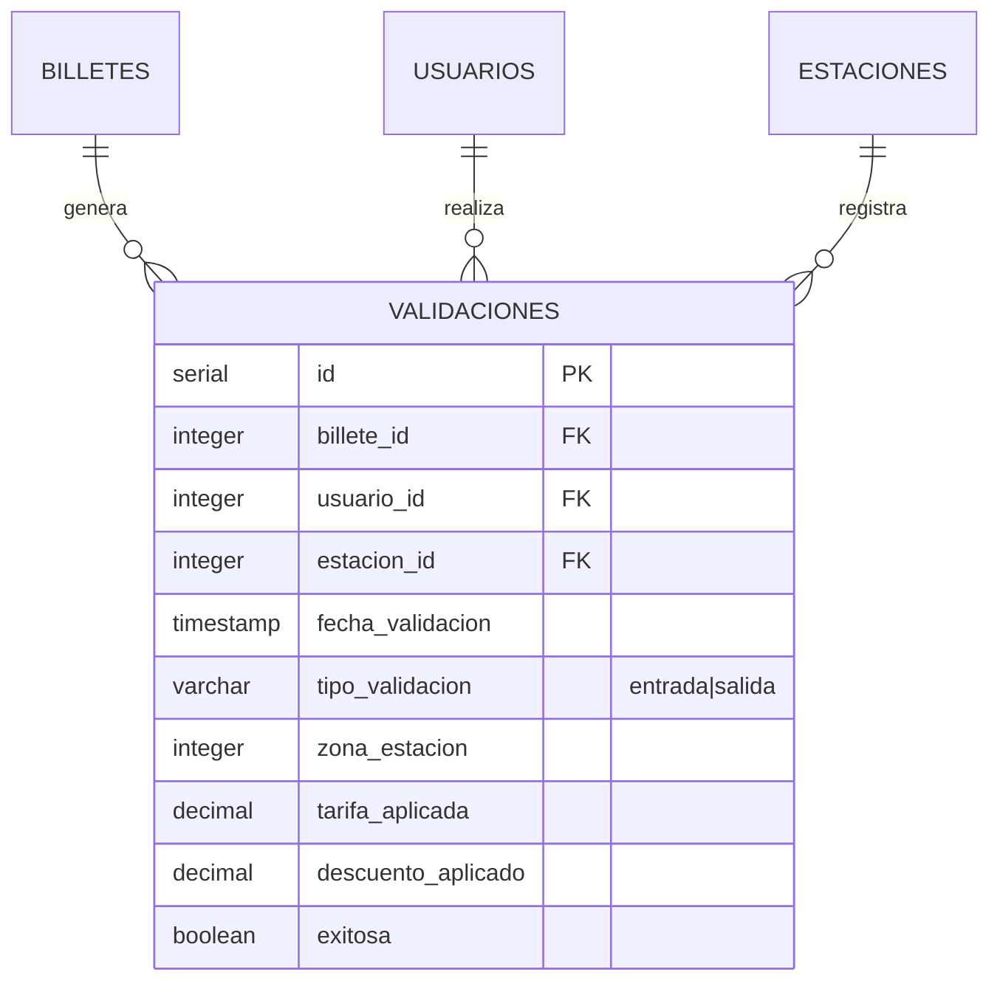
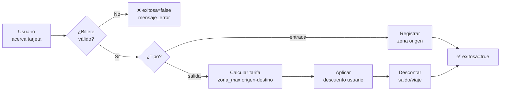

# Tabla: `VALIDACIONES`

**Propósito**: Tabla de hechos principal del sistema. Registra cada transacción de entrada o salida en las estaciones, incluyendo la tarifa aplicada y posibles descuentos. Es la fuente de datos para facturación, estadísticas de aforo y análisis de uso.

**Dominio**: 📊 Operacional (Alta escritura)

---

## Columnas

| Columna | Tipo | Restricciones | Descripción |
|---------|------|---------------|-------------|
| `id` | SERIAL | **PK** | Identificador único auto-incremental |
| `billete_id` | INTEGER | **FK** → billetes(id) | Título de transporte utilizado |
| `usuario_id` | INTEGER | **FK** → usuarios(id) | Usuario que realiza el viaje |
| `estacion_id` | INTEGER | **FK** → estaciones(id) | Estación donde se valida |
| `fecha_validacion` | TIMESTAMP | DEFAULT CURRENT_TIMESTAMP | Momento exacto de la validación |
| `tipo_validacion` | VARCHAR(10) | CHECK ('entrada','salida') | Tipo de movimiento en torniquete |
| `zona_estacion` | INTEGER | NOT NULL | Zona de la estación (desnormalizado para rendimiento) |
| `tarifa_aplicada` | DECIMAL(10,2) | - | Importe cobrado por el viaje |
| `descuento_aplicado` | DECIMAL(5,2) | DEFAULT 0.00 | Porcentaje de descuento aplicado |
| `exitosa` | BOOLEAN | DEFAULT true | Si la validación fue correcta |
| `mensaje_error` | TEXT | - | Descripción del error si falló |

---

## Relaciones



| Relación | Tabla Relacionada | Cardinalidad | Descripción |
|----------|-------------------|--------------|-------------|
| FK a BILLETES | `billetes.id` | N:1 | Cada validación usa un billete |
| FK a USUARIOS | `usuarios.id` | N:1 | Cada validación la hace un usuario |
| FK a ESTACIONES | `estaciones.id` | N:1 | Cada validación ocurre en una estación |

---

## Índices

| Nombre | Columnas | Tipo | Propósito |
|--------|----------|------|-----------|
| `validaciones_pkey` | id | PRIMARY KEY | Búsqueda por ID |
| `idx_validaciones_fecha` | fecha_validacion | INDEX | Reportes por período |
| `idx_validaciones_billete` | billete_id | INDEX | Historial de un título |
| `idx_validaciones_estacion` | estacion_id | INDEX | Aforo por estación |

---

## Reglas de Negocio

### Excepción: Menores de 6 Años

> ⚠️ **REGLA DE NEGOCIO CRÍTICA**: Los menores de 6 años viajan **GRATIS** en Metro Bilbao.
> No requieren billete, no pasan por torniquete y **NO generan registros en esta tabla**.
> Deben ir acompañados de un adulto con título de transporte válido.

### Flujo de Validación



### Cálculo de Tarifa

1. **Zona máxima** = MAX(zona_entrada, zona_salida)
2. **Tarifa base** según zona: €1.50 / €2.00 / €2.50
3. **Descuento** según `tipo_usuario`:
   - estudiante: 30% → `descuento_aplicado = 0.30`
   - tercera_edad: 50% → `descuento_aplicado = 0.50`
4. **Tarifa final** = tarifa_base × (1 - descuento)

### Errores Comunes

| mensaje_error | Causa |
|--------------|-------|
| `SALDO_INSUFICIENTE` | Billete sin saldo para el viaje |
| `BILLETE_CADUCADO` | `fecha_expiracion` superada |
| `ZONA_NO_PERMITIDA` | `zona_validez` < zona estación |
| `SIN_ENTRADA_PREVIA` | Intento de salida sin entrada registrada |

---

## Ejemplos de Datos

```sql
INSERT INTO validaciones (billete_id, usuario_id, estacion_id, tipo_validacion, zona_estacion, tarifa_aplicada, descuento_aplicado, exitosa) VALUES
(1, 1, 5, 'entrada', 1, NULL, 0.00, true),
(1, 1, 12, 'salida', 2, 2.00, 0.00, true),
(2, 2, 3, 'entrada', 1, NULL, 0.00, true),
(2, 2, 8, 'salida', 1, 1.05, 0.30, true),  -- Estudiante con 30% dto
(3, 3, 1, 'entrada', 1, NULL, 0.00, false); -- Error ejemplo
```

---

## Consultas Frecuentes

```sql
-- Aforo por estación (últimas 24h)
SELECT e.nombre, COUNT(*) as validaciones,
       SUM(CASE WHEN v.tipo_validacion = 'entrada' THEN 1 ELSE 0 END) as entradas,
       SUM(CASE WHEN v.tipo_validacion = 'salida' THEN 1 ELSE 0 END) as salidas
FROM validaciones v
JOIN estaciones e ON v.estacion_id = e.id
WHERE v.fecha_validacion >= CURRENT_TIMESTAMP - INTERVAL '24 hours'
  AND v.exitosa = true
GROUP BY e.id, e.nombre
ORDER BY validaciones DESC;

-- Ingresos por zona y día
SELECT DATE(fecha_validacion) as fecha,
       zona_estacion,
       SUM(tarifa_aplicada) as ingresos,
       COUNT(*) as num_viajes
FROM validaciones
WHERE tipo_validacion = 'salida' AND exitosa = true
GROUP BY DATE(fecha_validacion), zona_estacion
ORDER BY fecha DESC, zona_estacion;

-- Tasa de errores por tipo
SELECT mensaje_error, COUNT(*) as ocurrencias,
       ROUND(COUNT(*) * 100.0 / SUM(COUNT(*)) OVER(), 2) as porcentaje
FROM validaciones
WHERE exitosa = false
GROUP BY mensaje_error
ORDER BY ocurrencias DESC;

-- Horas punta (distribución horaria)
SELECT EXTRACT(HOUR FROM fecha_validacion) as hora,
       COUNT(*) as validaciones
FROM validaciones
WHERE exitosa = true
  AND fecha_validacion >= CURRENT_DATE - INTERVAL '7 days'
GROUP BY EXTRACT(HOUR FROM fecha_validacion)
ORDER BY hora;
```

---

## Consideraciones de Rendimiento

⚠️ **Tabla de alto volumen** (~10M+ registros/año)

**Recomendaciones**:
- Particionar por `fecha_validacion` (mensual o trimestral)
- Archivar datos > 2 años a tabla histórica
- Considerar índice parcial para `exitosa = false` (debugging)

```sql
-- Ejemplo de particionamiento por rango
CREATE TABLE validaciones_2025_q4 PARTITION OF validaciones
    FOR VALUES FROM ('2025-10-01') TO ('2026-01-01');
```
