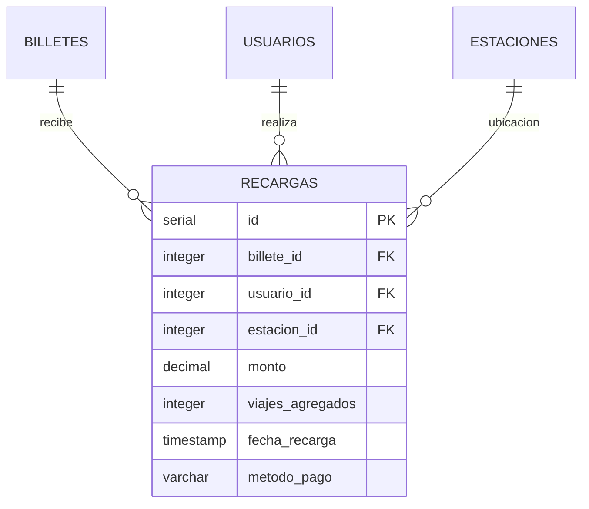
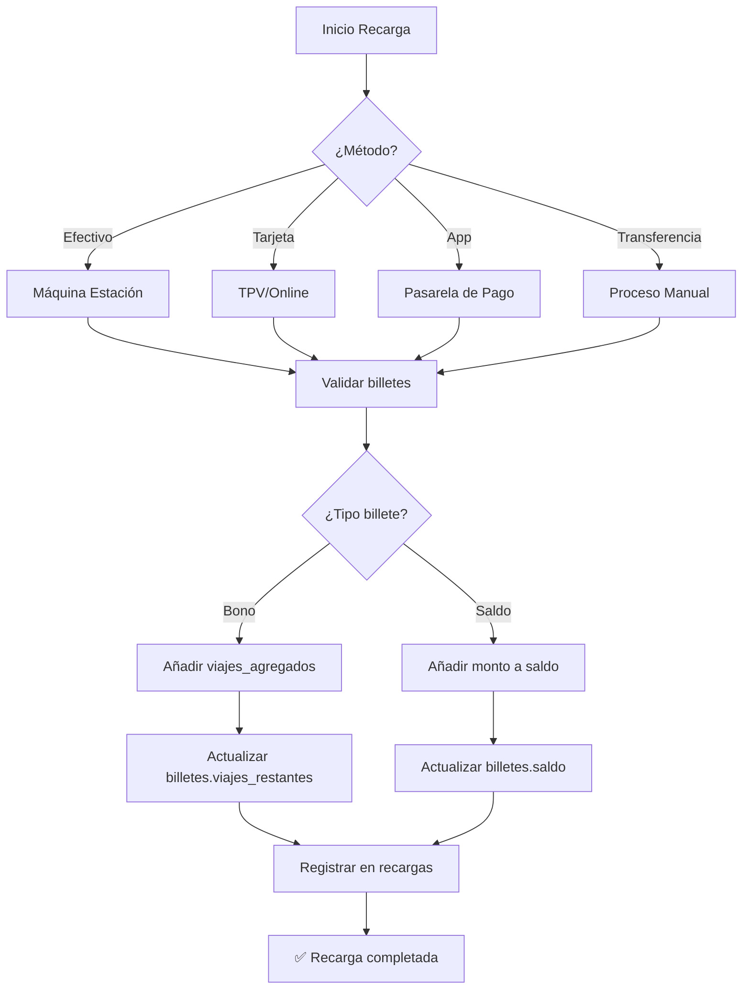

# Tabla: `RECARGAS`

**Propósito**: Historial de transacciones de recarga de saldo o viajes en títulos de transporte. Permite trazabilidad financiera y análisis de patrones de recarga por ubicación y método de pago.

**Dominio**: 📊 Operacional (Financiero)

---

## Columnas

| Columna | Tipo | Restricciones | Descripción |
|---------|------|---------------|-------------|
| `id` | SERIAL | **PK** | Identificador único auto-incremental |
| `billete_id` | INTEGER | **FK** → billetes(id) | Título de transporte recargado |
| `usuario_id` | INTEGER | **FK** → usuarios(id) | Usuario que realiza la recarga |
| `monto` | DECIMAL(10,2) | NOT NULL | Importe de la recarga (€) |
| `viajes_agregados` | INTEGER | DEFAULT 0 | Número de viajes añadidos (para bonos) |
| `fecha_recarga` | TIMESTAMP | DEFAULT CURRENT_TIMESTAMP | Momento de la transacción |
| `metodo_pago` | VARCHAR(30) | CHECK | Forma de pago: 'efectivo', 'tarjeta', 'app', 'transferencia' |
| `estacion_id` | INTEGER | **FK** → estaciones(id) | Estación donde se realizó (NULL si es online) |

---

## Relaciones



| Relación | Tabla Relacionada | Cardinalidad | Descripción |
|----------|-------------------|--------------|-------------|
| FK a BILLETES | `billetes.id` | N:1 | Cada recarga va a un billete |
| FK a USUARIOS | `usuarios.id` | N:1 | Cada recarga la hace un usuario |
| FK a ESTACIONES | `estaciones.id` | N:1 | Ubicación física (opcional) |

---

## Índices

| Nombre | Columnas | Tipo | Propósito |
|--------|----------|------|-----------|
| `recargas_pkey` | id | PRIMARY KEY | Búsqueda por ID |

**Índices recomendados** (no incluidos en schema original):
```sql
CREATE INDEX idx_recargas_fecha ON recargas(fecha_recarga);
CREATE INDEX idx_recargas_billete ON recargas(billete_id);
CREATE INDEX idx_recargas_metodo ON recargas(metodo_pago);
```

---

## Reglas de Negocio

### Métodos de Pago

| Método | Ubicación | Descripción |
|--------|-----------|-------------|
| `efectivo` | Estación | Máquinas expendedoras en estaciones |
| `tarjeta` | Estación/Online | Tarjeta bancaria (débito/crédito) |
| `app` | Online | App móvil Metro Bilbao |
| `transferencia` | Online | Transferencia bancaria (empresas) |

### Flujo de Recarga



### Reglas de Validación

- El `monto` debe ser positivo y mayor a €0.50
- Si `metodo_pago = 'efectivo'`, `estacion_id` es obligatorio
- Si `metodo_pago IN ('app', 'transferencia')`, `estacion_id` puede ser NULL
- Los `viajes_agregados` solo aplican para billetes tipo bono

---

## Ejemplos de Datos

```sql
INSERT INTO recargas (billete_id, usuario_id, monto, viajes_agregados, metodo_pago, estacion_id) VALUES
(1, 1, 15.00, 10, 'efectivo', 5),      -- Recarga bono_10 en estación
(2, 2, 45.00, 0, 'tarjeta', NULL),     -- Recarga mensual online
(3, 3, 20.00, 0, 'app', NULL),         -- Recarga vía app
(1, 1, 15.00, 10, 'tarjeta', 12);      -- Segunda recarga del mismo usuario
```

---

## Consultas Frecuentes

```sql
-- Ingresos totales por método de pago (último mes)
SELECT metodo_pago,
       COUNT(*) as num_recargas,
       SUM(monto) as ingresos_total,
       ROUND(AVG(monto), 2) as ticket_medio
FROM recargas
WHERE fecha_recarga >= CURRENT_DATE - INTERVAL '30 days'
GROUP BY metodo_pago
ORDER BY ingresos_total DESC;

-- Estaciones con más recargas (presenciales)
SELECT e.nombre, COUNT(*) as recargas,
       SUM(r.monto) as volumen_euros
FROM recargas r
JOIN estaciones e ON r.estacion_id = e.id
WHERE r.estacion_id IS NOT NULL
GROUP BY e.id, e.nombre
ORDER BY recargas DESC
LIMIT 10;

-- Distribución horaria de recargas (patrones de uso)
SELECT EXTRACT(HOUR FROM fecha_recarga) as hora,
       metodo_pago,
       COUNT(*) as recargas
FROM recargas
WHERE fecha_recarga >= CURRENT_DATE - INTERVAL '7 days'
GROUP BY EXTRACT(HOUR FROM fecha_recarga), metodo_pago
ORDER BY hora, metodo_pago;

-- Usuarios con mayor volumen de recargas
SELECT u.nombre, u.apellidos, u.tipo_usuario,
       COUNT(r.id) as num_recargas,
       SUM(r.monto) as total_recargado
FROM usuarios u
JOIN recargas r ON u.id = r.usuario_id
WHERE r.fecha_recarga >= CURRENT_DATE - INTERVAL '90 days'
GROUP BY u.id, u.nombre, u.apellidos, u.tipo_usuario
ORDER BY total_recargado DESC
LIMIT 20;

-- Tendencia de recargas online vs presencial
SELECT DATE_TRUNC('week', fecha_recarga) as semana,
       CASE WHEN estacion_id IS NULL THEN 'Online' ELSE 'Presencial' END as canal,
       SUM(monto) as volumen
FROM recargas
WHERE fecha_recarga >= CURRENT_DATE - INTERVAL '3 months'
GROUP BY DATE_TRUNC('week', fecha_recarga), 
         CASE WHEN estacion_id IS NULL THEN 'Online' ELSE 'Presencial' END
ORDER BY semana, canal;
```

---

## Consideraciones de Auditoría

Esta tabla es **crítica para conciliación financiera**. Se recomienda:

1. **No permitir DELETE**: Usar soft delete o tabla de anulaciones
2. **Trigger de auditoría**: Registrar cambios en tabla `recargas_audit`
3. **Backup diferencial**: Frecuencia alta por volumen transaccional

```sql
-- Ejemplo: Trigger de auditoría
CREATE OR REPLACE FUNCTION audit_recargas()
RETURNS TRIGGER AS $$
BEGIN
    INSERT INTO recargas_audit (recarga_id, accion, fecha, datos_anteriores)
    VALUES (OLD.id, TG_OP, CURRENT_TIMESTAMP, row_to_json(OLD));
    RETURN NEW;
END;
$$ LANGUAGE plpgsql;
```
