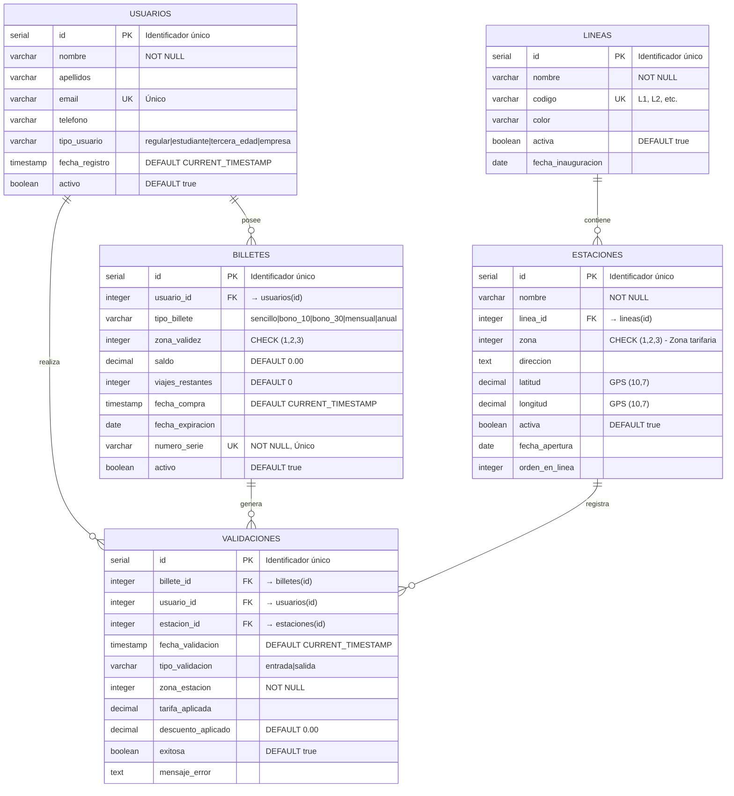

# Diagrama ERD - Metro Bilbao

> Diagrama Entity-Relationship generado desde `metro_schema.sql`

---

## 📊 Resumen de Relaciones

| Relación | Cardinalidad | Descripción |
|----------|--------------|-------------|
| USUARIOS → BILLETES | 1:N | Un usuario puede tener múltiples títulos de transporte |
| USUARIOS → VALIDACIONES | 1:N | Un usuario genera múltiples validaciones (viajes) |
| BILLETES → VALIDACIONES | 1:N | Cada billete puede usarse en múltiples validaciones |
| LINEAS → ESTACIONES | 1:N | Una línea contiene múltiples estaciones |
| ESTACIONES → VALIDACIONES | 1:N | Cada estación registra múltiples validaciones |

---

## 🔑 Claves del Diagrama

### Claves Primarias (PK)
Todas las tablas usan `SERIAL` (auto-incremental) como PK

### Claves Foráneas (FK)
- `billetes.usuario_id` → `usuarios.id`
- `estaciones.linea_id` → `lineas.id`
- `validaciones.billete_id` → `billetes.id`
- `validaciones.usuario_id` → `usuarios.id`
- `validaciones.estacion_id` → `estaciones.id`

### Claves Únicas (UK)
- `usuarios.email`
- `billetes.numero_serie`
- `lineas.codigo`

---

## ⚠️ Regla de Negocio

> **MENORES DE 6 AÑOS**: Viajan gratis y no aparecen en este modelo de datos (no requieren billete ni validación).

---

## 👁️ Visualización

Para ver este diagrama:
1. Abre este archivo en VS Code
2. Instala la extensión **Markdown Preview Mermaid Support** (`bierner.markdown-mermaid`)
3. Pulsa `Cmd+Shift+V` (Mac) o `Ctrl+Shift+V` (Windows/Linux)
